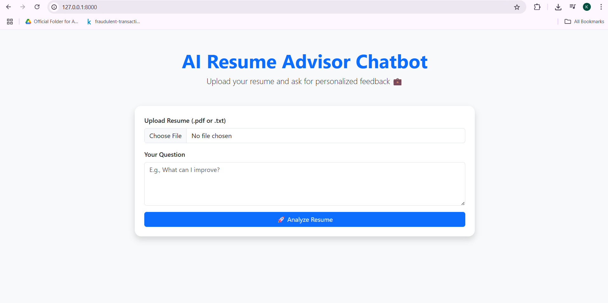

## 🧠 AI Resume Advisor Chatbot
A smart web application that lets users upload their resume and receive personalized feedback using the Groq LLM (LLaMA 3.3 70B Versatile) model. Built with FastAPI, Bootstrap 5, and supports .pdf or .txt resumes.

### 🚀 Features
📄 Upload resume in PDF or text format

💬 Ask questions like "How can I improve my resume?"

🧠 Uses LLaMA 3.3 model via Groq for feedback

💡 Built with FastAPI & Bootstrap 5 for sleek UI

### 🛠️ Tech Stack
FastAPI

Groq API (LLaMA 3.3 70B)

HTML + Bootstrap 5

PyPDF2

dotenv, requests

### ⚙️ Installation
#### Clone or Download the Project

git clone https://github.com/yourusername/resume_advisor_chatbot.git
cd resume_advisor_chatbot
#### Set up Virtual Environment (Optional but Recommended)
python -m venv venv
source venv/bin/activate  # Linux/macOS
venv\Scripts\activate     # Windows
#### Install Dependencies
pip install -r requirements.txt
#### Add Your API Key
Create a .env file:

GROQ_API_KEY=your_groq_api_key_here
#### ▶️ Run the App

uvicorn app:app --reload
Then open your browser at:
📍 http://127.0.0.1:8000

